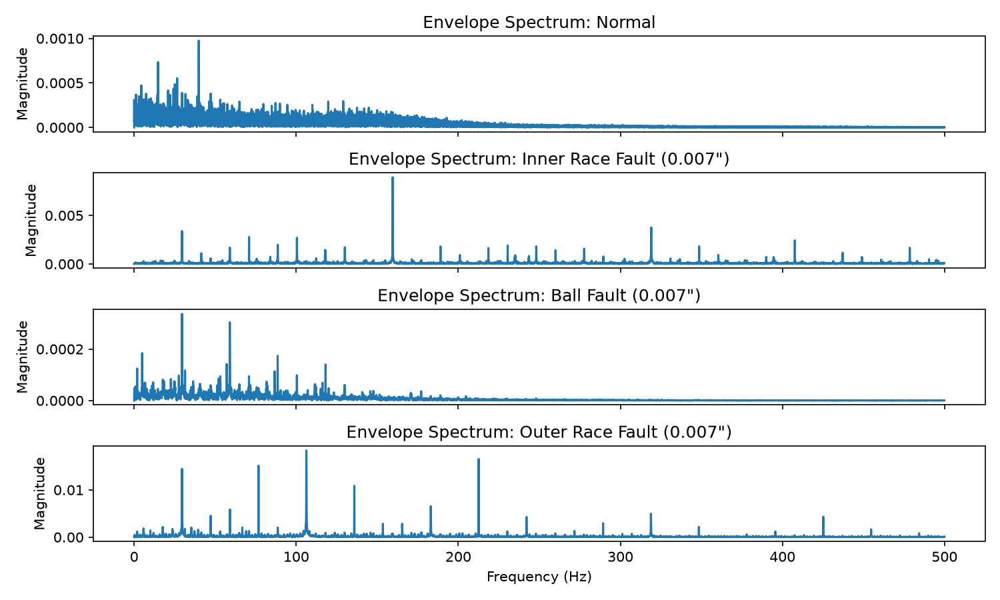
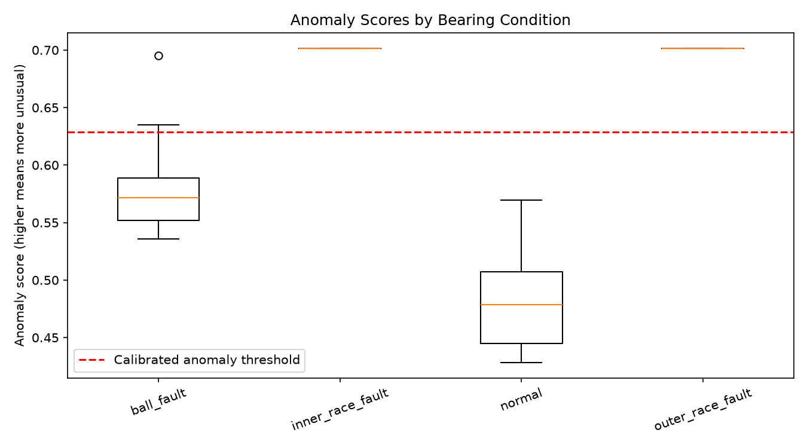

# Bearing Anomaly Detection

A vibration-analysis and anomaly-detection project using the Case Western
Reserve University (CWRU) bearing dataset.

## Objective

Identify bearing-fault signatures using vibration signals, then train a
normal-data-only anomaly detector to flag unusual bearing behaviour.

## Dataset

- CWRU drive-end accelerometer data
- Sampling rate: 12 kHz
- Operating condition: approximately 1 hp and 1772 RPM
- Conditions: normal, inner-race fault, ball fault, outer-race fault
- Fault size analysed: 0.007 inch

## Bearing-frequency theory

| Signature | Expected frequency (Hz) |
|---|---:|
| Shaft rotation | 29.53 |
| Inner race, BPFI | 159.93 |
| Outer race, BPFO | 105.87 |
| Ball fault, 2xBSF | 139.20 |

## Signal-processing results

Envelope analysis uses band-pass filtering, the Hilbert-transform envelope,
and an envelope spectrum.

Two resonance-band selection methods were compared:

- Method A: fixed-width spectral-kurtosis-inspired baseline
- Method B: multi-resolution kurtosis band scan with 250, 500, and 1000 Hz bands

| Condition | Envelope-analysis result |
|---|---|
| Normal | No fault-frequency claim |
| Inner race | 159.6 Hz, matching BPFI |
| Outer race | 106.3 Hz and 212.6 Hz, matching BPFO and its second harmonic |
| Ball | No clear 2xBSF signature with the current configuration |

Method B improved outer-race detection while preserving the inner-race result.



## Anomaly detection

Each recording is split into non-overlapping 1-second windows. For each window,
the project extracts:

- RMS: overall vibration energy
- Kurtosis: impulsiveness
- Crest factor: sharp peak relative to signal level

An Isolation Forest is trained on the first half of normal windows. The anomaly
threshold is calibrated using the 95th percentile of training-normal scores.

| Condition | Flagged anomaly windows |
|---|---:|
| Held-out normal | 0% |
| Inner-race fault | 100% |
| Outer-race fault | 100% |
| Ball fault | 20% |



These results are a proof of concept. Windows from one recording are related,
so this does not prove generalisation to other machines or operating conditions.

## Project structure

```text
src/
  theoretical_frequencies.py  Bearing-frequency calculations
  plot_fft.py                 FFT preprocessing and spectrum
  envelope_analysis.py        Envelope-analysis workflow
  band_scan.py                Multi-resolution band selection
  features.py                 Windowing and feature extraction
  feature_dataset.py          Create window-level feature data
  anomaly_detection.py        Train and evaluate Isolation Forest

tests/                        Unit tests
docs/experimental_protocol.md Scientific protocol and results
figures/                      Generated plots